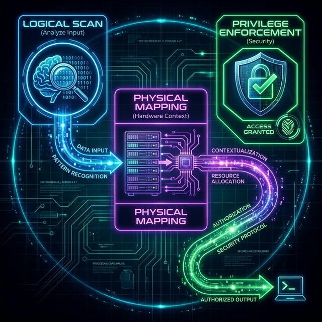

# 🌌 Vega: The Sovereign SRE Agent

[]()
[]()
[]()

> **🚧 Current Status**: Testing system configuration tasks via SSH access to OS running on QEMU.
> **🚧 현재 상태**: QEMU에서 구동 중인 OS에 SSH로 접속하여 시스템 설정 작업을 테스트 중입니다.

> **"The Pocket Knife Strategy"**
>
> A non-resident, lightweight system administration agent that respects your shell environment. Refuses to be a daemon.
>
> **"공돌이의 직관과 AI의 추론을 결합한 리눅스 자율 운영 시스템"**
> 데몬으로 상주하지 않고, 필요할 때만 호출되어 쉘 환경을 존중하는 경량 시스템 관리 에이전트입니다.

---

### 🛡️ Core Logic Update: "Discovery First"

> **"질문은 최후의 수단이다."** (Questions are a last resort.)

VEGA는 네트워크(DHCP), 가상화 에이전트(QEMU Agent), ARP 테이블 등 가용한 모든 도구를 총동원해 스스로 정보를 확보합니다. 확보된 정보는 즉시 내부 상태 데이터베이스(State DB)에 기록되어 다음 작업의 맥락으로 활용됩니다.

- **동적 탐색 (Silent Discovery):** 불완전한 정보(예: IP 없음) 수신 시 즉시 백그라운드 탐색 수행.
- **상태 박제 (Resolve & Persist):** 찾아낸 시스템 정보는 즉시 기록하여 불필요한 재질의 원천 차단.
- **동적 데이터베이스 (State DB):** 사고 과정을 보여주는 대시보드를 넘어, 스스로 찾아낸 시스템 정보의 박제소 역할.

---

## 🧠 Core Architecture / 핵심 아키텍처

Vega operates on a 3-stage **Reasoning Engine** to ensure safety and accuracy.
Vega는 안전하고 정확한 실행을 위해 3단계 **추론 엔진**을 기반으로 작동합니다.



1.  **Logical Scan (논리적 분석)**
    *   **Goal**: Understand user intent and identify target objects (files, processes, paths).
    *   **Korean**: 사용자의 의도를 파악하고 대상 객체(파일, 프로세스, 경로)를 식별합니다.
2.  **Physical Mapping (물리적 대조)**
    *   **Goal**: Map targets to physical resources (Partitions, SSH hosts) and verify existence.
    *   **Korean**: 대상이 실제 존재하는지, 어느 파티션이나 원격지에 위치하는지 확인합니다.
3.  **Privilege Enforcement (권한 및 보안)**
    *   **Goal**: Apply 'Least Privilege' principles and generate the safest possible command.
    *   **Korean**: '최소 권한' 원칙을 적용하여 가장 안전한 실행 명령어를 생성합니다.

---

## 📦 Build Prerequisites / 빌드 사전 요구사항

Before building from source, install the required development packages:
소스에서 빌드하기 전에 필요한 개발 패키지를 설치하세요:

```bash
# Fedora / RHEL / CentOS
sudo dnf install -y openssl-devel pkg-config sqlite-devel

# Ubuntu / Debian
sudo apt install -y libssl-dev pkg-config libsqlite3-dev sqlite3

# Arch Linux
sudo pacman -S openssl pkg-config sqlite
```

**Common Build Dependencies (Rust Crates):**
The following crates are automatically handled by Cargo, but ensure your environment supports them:
- `colored` (Terminal colors)
- `reqwest` (HTTP Client for AI)
- `async-trait` (Async traits)
- `serde` & `serde_json` (JSON Parsing)
- `ssh2` (SSH Protocol)

> **Why?** Vega uses `ssh2` crate which depends on `openssl-sys`. The OpenSSL development headers are required for compilation.
>
> **왜 필요한가요?** Vega는 `ssh2` 크레이트를 사용하며, 이는 `openssl-sys`에 의존합니다. 컴파일을 위해 OpenSSL 개발 헤더가 필요합니다.

### 🔧 Troubleshooting Build Issues / 빌드 문제 해결

If you still get `openssl-sys` errors after installing the packages, try these steps:
패키지 설치 후에도 `openssl-sys` 에러가 발생하면 다음을 시도하세요:

**1. Verify OpenSSL installation / OpenSSL 설치 확인:**
```bash
# Check if openssl.pc exists
pkg-config --modversion openssl

# If the above fails, find openssl.pc manually
find /usr -name "openssl.pc" 2>/dev/null
```

**2. Set PKG_CONFIG_PATH manually / PKG_CONFIG_PATH 수동 설정:**
```bash
# Common locations (adjust based on your system)
# Fedora/RHEL
export PKG_CONFIG_PATH=/usr/lib64/pkgconfig:$PKG_CONFIG_PATH

# Ubuntu/Debian
export PKG_CONFIG_PATH=/usr/lib/x86_64-linux-gnu/pkgconfig:$PKG_CONFIG_PATH

# Then retry build
cargo build --release
```

**3. Alternative: Use vendored OpenSSL / 대안: 번들된 OpenSSL 사용:**
```bash
# This will compile OpenSSL from source (slower but more reliable)
cargo build --release --features vendored-openssl
```

> **Note:** If using vendored OpenSSL, you'll also need `perl` and `make` installed.
>
> **참고:** 번들된 OpenSSL을 사용하는 경우 `perl`과 `make`도 설치되어 있어야 합니다.

---

## ⚡ Installation / 설치 방법

Vega is built as a single static binary. No runtime dependencies required.
Vega는 단일 정적 바이너리로 빌드됩니다. 런타임 의존성은 필요하지 않습니다.

```bash
# 1. Build Release Binary
cargo build --release

# 2. Create local bin directory (if it doesn't exist)
mkdir -p ~/.local/bin

# 3. Install to local bin
cp target/release/vega ~/.local/bin/

# 4. Add to PATH (if not already added)
echo 'export PATH="$HOME/.local/bin:$PATH"' >> ~/.zshrc
source ~/.zshrc

# 5. Verify installation
vega --help
```

> **Note on Build Warnings:** You may see warnings about unused imports and variables during compilation. These are normal and do not affect functionality. The build is successful if you see `Finished \`release\` profile [optimized]` at the end.
>
> **빌드 경고 안내:** 컴파일 중 사용하지 않는 import나 변수에 대한 경고가 표시될 수 있습니다. 이는 정상이며 기능에 영향을 주지 않습니다. 마지막에 `Finished \`release\` profile [optimized]`가 표시되면 빌드가 성공한 것입니다.

---

## 🛠️ Usage / 사용 방법

### 1. Setup / 초기 설정
Launch the interactive wizard to configure API keys and preferences.
대화형 마법사를 실행하여 API 키와 설정을 구성합니다.

```bash
vega setup
```

### 2. Google Login & Managed Billing / 구글 로그인 및 빌링 관리
Authenticate with your Google account to bypass standard API key limits and leverage project-based quotas.
구글 계정으로 로그인하여 표준 API 키 제한을 우회하고 프로젝트 기반 할당량을 활용하세요.

```bash
vega login
```

- **Higher Quotas**: Managed accounts typically enjoy 15-60 RPM vs 2-15 RPM for free keys.
- **Auto-Renewal**: Uses OAuth2 Refresh Tokens for seamless background session management.
- **Enterprise Friendly**: Works with GCP "Application Default Credentials" (ADC) discovery.
- **Fallback Logic**: If OAuth tokens expire or fail, VEGA automatically falls back to your configured API Key or Web Session.

---

### 3. History & Memory Management / 히스토리 및 메모리 관리
Browse your past triumphs and re-run complex commands via the `fzf`-powered interface.
`fzf` 인터페이스를 통해 과거의 빛나는 작업 기록을 검색하고 복잡한 명령어를 즉시 재실행하세요.

```bash
vega history
```

> **Backend (FTS5)**: Past interactions are indexed in an "Unconscious Memory" (SQLite FTS5) to provide AI with relevant context.
> **Frontend (fzf)**: Use the interactive UI to search, filter, and execute history items.

---

### 4. Natural Language Command / 자연어 명령
Ask Vega to perform tasks using plain English or Korean.
평범한 자연어로 작업을 요청하세요.

```bash
# English
vega "Find all files larger than 1GB in /home"

# Korean
vega "현재 디렉토리에서 1GB 이상인 파일 찾아줘"
```

> **AI Execution Flow:**
> 1.  **Reasoning (CoT)**: View the AI's internal thought process before the suggestion.
> 2.  **Analysis**: Vega processes your natural language request.
> 3.  **Proposal**: It presents a JSON-formatted plan with a `Risk Level` (INFO/WARNING/CRITICAL).
> 4.  **Confirmation**: You are prompted to execute the command (`[y/N]`).
> 5.  **Action**: Upon approval, the command is executed immediately.

---

## 📋 Internal Commands / 내부 명령어

Vega provides several built-in commands for direct control.
Vega는 직접 제어를 위한 다양한 내장 명령어를 제공합니다.

| Command / 명령어 | Description (EN) | Description (KR) |
| :--- | :--- | :--- |
| `setup` | Run the configuration wizard | 설정 마법사 실행 |
| `login` | Authenticate via Google OAuth2 | 구글 OAuth2 인증 및 로그인 |
| `history` | Interactive history UI via fzf | fzf 기반 대화형 히스토리 UI |
| `install <pkg>` | Install packages (detects apt/dnf/pacman) | 패키지 설치 (패키지 매니저 자동 감지) |
| `connect <host>` | SSH connection with context memory | 컨텍스트 메모리를 활용한 SSH 연결 |
| `status` | Show system status dashboard | 시스템 상태 대시보드 표시 |
| `health` | Analyze system logs and suggest fixes | 시스템 로그 분석 및 해결책 제안 |
| `backup <src> <dst>` | Smart backup with validation | 검증 과정을 포함한 스마트 백업 |
| `refresh <target>` | Refresh SSH host context | SSH 호스트 컨텍스트 갱신 |
| `update --all` | Update system packages | 시스템 패키지 일괄 업데이트 |
| `config` | Sync shell environment snapshot | 쉘 환경 스냅샷 동기화 |

---

## 🛡️ Safety Features / 보안 기능

*   **Explicit Confirmation**: Critical commands (`rm`, `dd`) require typing "YES".
*   **Data Redaction**: Sensitive data (IPs, Keys) is redacted before sending to AI.
*   **Local Processing**: Simple commands match locally (Regex/Fuzzy) without API calls.

*   **명시적 승인**: 치명적인 명령어(`rm`, `dd`)는 "YES"를 입력해야 실행됩니다.
*   **데이터 비식별화**: 민감한 정보(IP, 키)는 AI 전송 전 마스킹 처리됩니다.
*   **로컬 처리**: 단순 명령어는 API 호출 없이 로컬에서 즉시 매칭됩니다.

---

## 📄 License

MIT License.
