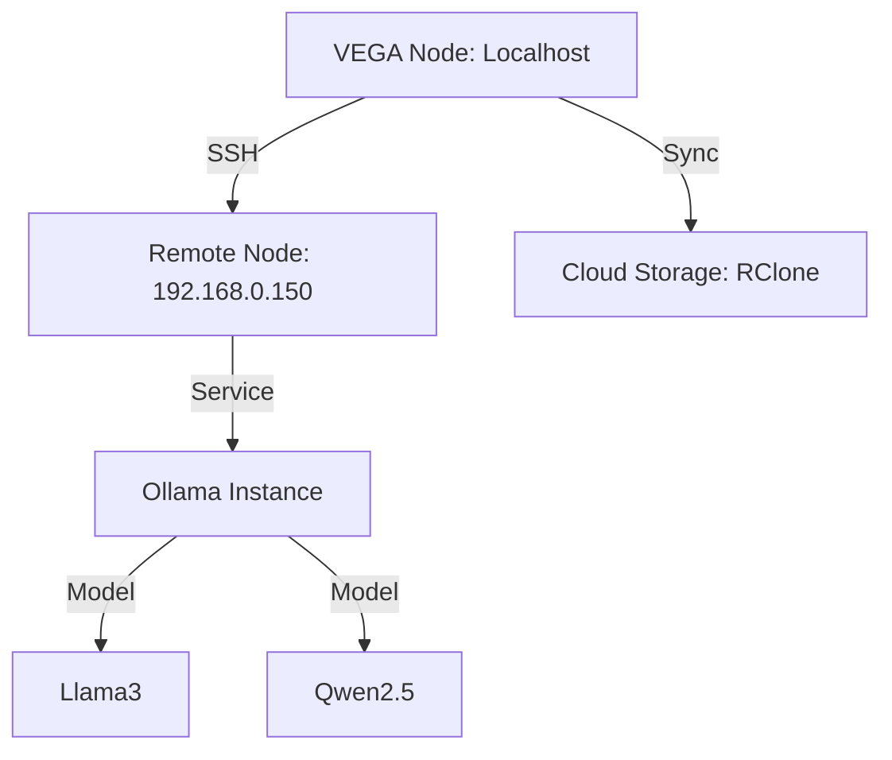

# 🌌 Milestone: Environment-Aware Orchestration Cognition

## 🎯 Objective
자연어의 "의도"를 넘어, 현재 관리 중인 인프라의 "상태"와 "관계"를 추론의 핵심 컨텍스트로 통합합니다. 단순한 문자열 매칭을 넘어서는 **Environment Grounding**을 실현합니다.

## 🏗️ Architecture: Environment Memory Graph
VEGA는 이제 인프라를 단순한 리스트가 아닌 그래프 구조로 관리합니다.

### 1. Semantic Environment Resolution (Grounding)
- **Problem**: "ssh에 연결된 시스템" → `localhost` 리졸빙 오류 (Contamination).
- **Solution**: `EnvironmentQuery` 엔진 도입.
  - "원격 머신" → `Graph.find_nodes(type=RemoteHost, state=Reachable).primary()`
  - "GPU 있는 노드" → `Graph.find_nodes(capability=GPU)`

### 2. Infrastructure Memory (Context Injection)
- **Short-term**: 라우터 프롬프트에 상세 인프라 명세(User, IP, Port, Status) 주입. [COMPLETED]
- **Long-term**: `SystemContext` 내에 `InfrastructureGraph` 구조체 포함 및 LLM 전용 인벤토리 직렬화.

### 3. Canonical Target Cognition
- **Heuristic Resolver**: `main.rs` 내에 추상적 지시어(ssh, remote, node 등)를 실제 노드로 매핑하는 휴리스틱 레이어 강화. [COMPLETED]
- **Strict Policy**: 명시적 요청 없이 `localhost`로 폴백하는 것을 금지하여 로컬 시스템 오염 방지.

## 📈 Roadmap (Phase 5+)
- [ ] **SQLite Meta Table**: 인프라 노드 간의 관계성 저장.
- [ ] **Capability Discovery 2.0**: 노드별 VRAM, CPU 코어수, 설치된 런타임 자동 태깅.
- [ ] **Fleet-wide Inference**: "현재 fleet에서 가동률 가장 낮은 노드에 배포해" 등의 복합 추론 지원.

---
*"복잡함은 엔지니어의 허영심이 낳은 독약이라네. 인프라에 대한 명확한 기억만이 그 해독제가 될 것이야."* 🫡🌌
